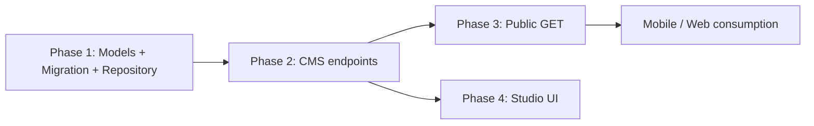

# RFC: Group Recitation Collections

| Field | Value |
|-------|-------|
| **Status** | Proposed |
| **Date** | 2026-07-20 |
| **Scope** | WeBuddhist-Backend |
| **Related** | Individual recitation collections (`/users/me/recitation-collections`), Author Groups (`/cms/author/groups`, `/author/groups`), Group Accumulators (`/cms/groups/.../accumulators`) |

---

## 1. Summary

Add **group-owned recitation collections**: curated, ordered lists of texts attached to an **Author Group**. CMS/Studio authors create and manage them; the public app reads them under `/author/groups`.

This mirrors the existing **user** feature (`recitation_collections` / `recitation_collection_items`) but replaces `user_id` ownership with `group_id`, and follows the same CMS + public split used by group accumulators.

---

## 2. Motivation

| Today | Gap |
|-------|-----|
| Users can create personal recitation collections | Groups cannot publish shared recitation sets |
| Groups already expose plans, series, and accumulations | No equivalent for recitation collections |
| Studio manages group content via CMS | No CMS APIs to curate group recitations |

Product need: each author/community group can publish one or more recitation collections for members and the public to practice together.

---

## 3. Goals

- Persist group-scoped collections and ordered text items in Postgres.
- CMS: create / list / update / delete collections; add / remove / reorder items.
- Public: list and fetch collection detail (with text metadata) for a group under `/author/groups`.
- Reuse existing text resolution (`get_texts_by_ids`), S3 presigned covers, and group permission helpers.

## 4. Non-goals (v1)

- Changes to user-owned `/users/me/recitation-collections`.
- Routines / `GROUP_RECITATION_COLLECTION` session type.
- Multilingual collection metadata (single `name` string, same as individual).
- Per-user progress on group collections.
- Draft/publish workflow (collections are visible once created on public groups).

---

## 5. Data model

### 5.1 `group_recitation_collections`

| Column | Type | Notes |
|--------|------|-------|
| `id` | UUID PK | `uuid4` |
| `group_id` | UUID FK → `author_groups.id` ON DELETE CASCADE | Owner |
| `name` | VARCHAR(255) NOT NULL | Display name |
| `img_url` | VARCHAR(1000) NOT NULL | S3 key; presign on read |
| `created_at` | TIMESTAMPTZ NOT NULL | Align with `author_groups` |
| `updated_at` | TIMESTAMPTZ NOT NULL | |
| `deleted_at` | TIMESTAMPTZ NULL | Soft delete (match group accumulators) |
| `created_by` | VARCHAR(255) NOT NULL | CMS audit (author email) |
| `updated_by` | VARCHAR(255) NULL | CMS audit |

**Indexes**

- `idx_group_recitation_collections_group_id` on `group_id`
- Optional: partial unique `(group_id, name)` WHERE `deleted_at IS NULL`

### 5.2 `group_recitation_collection_items`

| Column | Type | Notes |
|--------|------|-------|
| `id` | UUID PK | |
| `group_recitation_collection_id` | UUID FK → `group_recitation_collections.id` ON DELETE CASCADE | |
| `text_id` | UUID NOT NULL | Mongo text id (no Postgres FK) |
| `display_order` | INTEGER NOT NULL | 1-based ordering |

**Constraints**

- `UNIQUE (group_recitation_collection_id, text_id)`
- Index on `group_recitation_collection_id`

### 5.3 Relationship to individual tables

Do **not** reuse `recitation_collections` / `recitation_collection_items`. Keep separate tables so ownership, soft-delete, and audit fields stay clean and avoid nullable `user_id` / `group_id` polymorphism.

### 5.4 Migration

New Alembic revision creating both tables, FKs, indexes, and unique constraints (same style as the individual recitation collection migration).

---

## 6. Permissions

Reuse `pecha_api/plans/shared/permissions.py` (same as group accumulators CMS):

| Action | Helper / rule |
|--------|----------------|
| CMS list / detail | `require_can_read_group_content` (OWNER, ADMIN, AUTHOR, VIEWER) |
| CMS create / add items | `require_can_create_content` (OWNER, ADMIN, AUTHOR) |
| CMS update metadata / reorder / remove items | `require_can_create_content` or edit equivalent (AUTHOR+) |
| CMS delete collection | `require_can_change_status` (OWNER, ADMIN) — match accumulator delete |
| Public read | Group exists, `deleted_at IS NULL`; if `is_public = false`, hide or 404 (match existing public group content) |

All CMS routes require Bearer + `validate_cms_author_details`.

---

## 7. API design

### 7.1 URL conventions (decided)

Follow existing group content patterns:

| Audience | Prefix | Precedent |
|----------|--------|-----------|
| CMS (Studio) | `/cms/groups/{group_id}/recitation-collections` | `/cms/groups/{group_id}/accumulators` |
| Public / App | `/author/groups/{group_id}/recitation-collections` | `/author/groups/{group_id}/accumulations` |

> Note: Author group CRUD stays at `/cms/author/groups`. Content nested under a group uses `/cms/groups/{group_id}/...`.

### 7.2 Public endpoints

Auth: **optional** Bearer (same as `GET /author/groups/{group_id}`).  
Header: `X-Timezone` for China region filtering when restriction type is wired.

#### `GET /author/groups/{group_id}/recitation-collections`

List collections (summary, no items). Soft-deleted excluded. Paginated.

| Query | Type | Default |
|-------|------|---------|
| `skip` | int | 0 |
| `limit` | int | 20 (max 50) |

**Response `200` — `GroupRecitationCollectionsResponse`**

```json
{
  "collections": [
    {
      "id": "uuid",
      "group_id": "uuid",
      "name": "Morning Recitations",
      "img_url": "https://presigned...",
      "item_count": 12,
      "created_at": "2026-07-20T00:00:00Z",
      "updated_at": "2026-07-20T00:00:00Z"
    }
  ],
  "skip": 0,
  "limit": 20,
  "total": 1
}
```

#### `GET /author/groups/{group_id}/recitation-collections/{collection_id}`

Detail with ordered items; resolve titles/language/type via Mongo `get_texts_by_ids`.

**Response `200` — `GroupRecitationCollectionDetailDTO`**

```json
{
  "id": "uuid",
  "group_id": "uuid",
  "name": "Morning Recitations",
  "img_url": "https://presigned...",
  "created_at": "...",
  "updated_at": "...",
  "items": [
    {
      "id": "uuid",
      "text_id": "uuid",
      "title": "Heart Sutra",
      "language": "bo",
      "type": "root_text",
      "display_order": 1
    }
  ]
}
```

**Errors:** `404` group/collection missing or not visible.

---

### 7.3 CMS endpoints

Auth: **required** Bearer (CMS author).

Router prefix: `/cms/groups/{group_id}/recitation-collections`

| Method | Path | Purpose | Status |
|--------|------|---------|--------|
| `POST` | `` | Create empty collection | 201 |
| `GET` | `` | List collections | 200 |
| `GET` | `/{collection_id}` | Detail + items | 200 |
| `PUT` | `/{collection_id}` | Update name / cover | 200 |
| `DELETE` | `/{collection_id}` | Soft-delete collection | 204 |
| `POST` | `/{collection_id}/items` | Append texts | 201 |
| `PUT` | `/{collection_id}/items/reorder` | Reorder items | 200 |
| `DELETE` | `/{collection_id}/items/{item_id}` | Remove one item | 204 |
| `DELETE` | `/{collection_id}/items` | Bulk remove by `text_ids` (optional) | 200 |

#### Create — `POST /cms/groups/{group_id}/recitation-collections`

```json
{
  "name": "Evening Practice",
  "img_url": "uploads/groups/.../cover.jpg"
}
```

#### Add items — `POST .../{collection_id}/items`

```json
{
  "text_ids": ["uuid1", "uuid2"]
}
```

- Validate each text exists (`TextUtils.validate_text_exists`).
- Append after current max `display_order`.
- Duplicate `text_id` in same collection → `400` (unique constraint).

#### Reorder — `PUT .../{collection_id}/items/reorder`

```json
{
  "item_ids": ["uuid-item-3", "uuid-item-1", "uuid-item-2"]
}
```

Must include all current item ids; returns full detail.

---

## 8. Response models

```python
class GroupRecitationCollectionDTO(BaseModel):
    id: UUID
    group_id: UUID
    name: str
    img_url: Optional[str] = None
    item_count: int
    created_at: datetime
    updated_at: datetime

class GroupRecitationCollectionDetailDTO(BaseModel):
    id: UUID
    group_id: UUID
    name: str
    img_url: Optional[str] = None
    created_at: datetime
    updated_at: datetime
    items: List[RecitationCollectionItemDTO]  # reuse individual item DTO

class GroupRecitationCollectionsResponse(BaseModel):
    collections: List[GroupRecitationCollectionDTO]
    skip: int
    limit: int
    total: int
```

Item DTO can reuse `RecitationCollectionItemDTO` from the user module unchanged.

---

## 9. Module layout

```
pecha_api/group_recitation_collection/
  __init__.py
  group_recitation_collection_models.py
  group_recitation_collection_repository.py
  group_recitation_collection_response_models.py
  group_recitation_collection_service.py
  group_recitation_collection_views.py          # public GET under /author/groups
  group_recitation_collection_cms_views.py      # CMS under /cms/groups
```

Register both routers in `pecha_api/app.py`.

Alternatively, nest public routes on the existing `public_groups_router` in `groups_views.py` (same as accumulations). Prefer a dedicated module for clarity, with paths still under `/author/groups/...`.

---

## 10. Cross-cutting concerns

### 10.1 Images

Store S3 key in `img_url`; return presigned URL in API responses (same helper pattern as user recitation collections).

### 10.2 Region restrictions

`RestrictedItemType.RECITATION_COLLECTION` already exists for user collections. Options for v1:

1. Reuse `RECITATION_COLLECTION` and restrict by collection id, or
2. Add `GROUP_RECITATION_COLLECTION` and wire lookup helpers.

Recommend **option 2** for clear admin tooling. Public list/detail must filter by `X-Timezone` when restricted.

### 10.3 Cascade

Deleting an author group cascades collections and items via FK. Soft-deleted collections stay hidden from public/CMS list until hard-purged (if ever).

### 10.4 Group detail enrichment (optional follow-up)

`GET /author/groups/{group_id}` and CMS group detail may later include `recitation_collections_count` or a short preview list. Not required for v1.

---

## 11. Comparison with individual collections

| Aspect | Individual | Group (this RFC) |
|--------|------------|------------------|
| Owner | `user_id` | `group_id` |
| Create | Any authenticated user | CMS author + group role |
| Public read | No | Yes — `/author/groups/...` |
| Update / reorder / remove items | Mostly missing | Full CMS curation |
| Delete | Hard cascade | Soft delete recommended |

---

## 12. Implementation phases



| Phase | Deliverable |
|-------|-------------|
| **1** | Tables, models, Alembic migration, repository + unit tests |
| **2** | CMS CRUD + items endpoints (Studio-ready) |
| **3** | Public list + detail under `/author/groups` |
| **4** | Studio UI (consumer; out of backend scope) |

Suggested order matches product: CMS first so Studio can create content, then public reads.

---

## 13. Testing checklist

- [ ] Migration creates tables/indexes/constraints
- [ ] Repository: create, list, soft-delete, item order, unique text constraint
- [ ] CMS permission matrix (VIEWER read-only; AUTHOR create; OWNER/ADMIN delete)
- [ ] Invalid `text_id` → 404; duplicate item → 400
- [ ] Reorder with missing/extra `item_id` → 400
- [ ] Public: soft-deleted / private group not exposed
- [ ] Group delete cascades collections
- [ ] Presigned `img_url` returned on list/detail

---

## 14. Open questions

1. **Multiple collections per group?** Recommended: yes (paginated). Confirm with product.
2. **Publish status?** v1: live immediately. Future: `DRAFT` / `PUBLISHED` like plans.
3. **Embed on group detail?** Count/preview on `GET /author/groups/{group_id}` — defer unless product needs it for launch.
4. **Routines?** Follow-up if users should add a group collection to a personal routine.

---

## 15. Acceptance criteria

- [ ] Postgres has `group_recitation_collections` and `group_recitation_collection_items`.
- [ ] CMS author with create role can create a collection and add texts for a group.
- [ ] Public client can list and open collections for a public group via `/author/groups/{group_id}/recitation-collections`.
- [ ] Soft-deleted collections do not appear on public or CMS list endpoints.
- [ ] Permissions match other group CMS content (accumulators).
