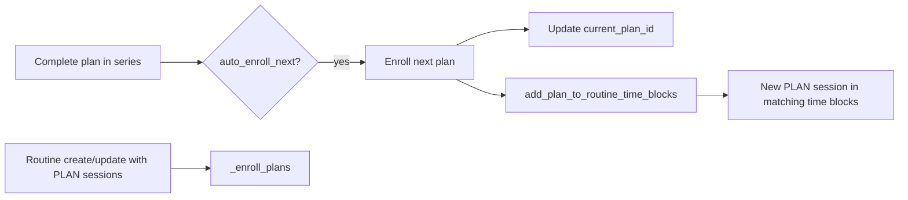

# Plan & series DTO reference

Reference for **live HTTP response shapes** and **lightweight reference models** for user progress, routines, practice catalog, public/CMS series, and profiles.

**Image convention (plans & series covers):** use `image: ImageUrlModel | null` (`thumbnail`, `medium`, `original`). Do not use a single `image_url` string on plan/series cover fields. Exceptions: user `avatar_url`, tag `image`, task/subtask content URLs.

Aligned with code under `pecha_api/plans/`, `pecha_api/routines/`, and `pecha_api/users/` (June 2026).

---

## How to read this doc

| Layer | Location | Used on wire? |
|-------|----------|----------------|
| **User progress** | `plan_users_response_models.py` | Yes — `/users/me/*` |
| **Practice catalog** | `dashboard_response_models.py` | Yes — `GET /practice/items` |
| **Public / CMS series** | `series_response_models.py` | Yes — `GET /series/*`, `/cms/series/*` |
| **Routines** | `routines_response_models.py` | Yes — `/routines`, `/users/me/routine` |
| **Profiles** | `user_response_models.py` | Yes — `/users/info`, `/users/{username}` |
| **Brief reference models** | `plans/shared/dto.py` | No — not returned by any endpoint yet |
| **Shared media** | `media_response_models.py` | Yes — `ImageUrlModel` embedded in responses above |

---

## Source files

| File | Role |
|------|------|
| `pecha_api/plans/shared/dto.py` | `UserInfoBriefDTO`, `SeriesPlanBriefDTO` (reference only) |
| `pecha_api/plans/users/plan_users_response_models.py` | Series, plan enrollment, progress, day/task models |
| `pecha_api/plans/users/plan_users_service.py` | Enrollment, progress, series → routine sync |
| `pecha_api/plans/users/plan_users_views.py` | Routes under `/users/me` |
| `pecha_api/plans/dashboard/dashboard_response_models.py` | `DashboardItemDTO`, `DashboardItemsResponse` |
| `pecha_api/plans/dashboard/dashboard_service.py` | `get_practice_items_list`, `get_dashboard_items_list` |
| `pecha_api/plans/dashboard/dashboard_views.py` | `GET /practice/items`, `GET /cms/dashboard/items` |
| `pecha_api/plans/series/series_response_models.py` | `SeriesDTO`, `SeriesPlanDTO`, list items |
| `pecha_api/plans/series/series_service.py` | Series CRUD, `_plan_to_dto`, `get_series_detail` |
| `pecha_api/plans/series/public_series_view.py` | `GET /series`, `GET /series/{series_id}` |
| `pecha_api/plans/series/series_view.py` | `/cms/series/*` |
| `pecha_api/plans/media/media_response_models.py` | `ImageUrlModel` |
| `pecha_api/plans/authors/plan_authors_service.py` | `get_image_url()`, `safe_get_image_url()` |
| `pecha_api/routines/routines_response_models.py` | Routine time blocks and sessions |
| `pecha_api/routines/routines_service.py` | Routine CRUD, session resolution, plan auto-enroll |
| `pecha_api/routines/routines_views.py` | `/routines` and `/users/me/routine` |
| `pecha_api/users/user_response_models.py` | `UserInfoResponse`, `UserInfoRequest` |
| `pecha_api/users/users_views.py` | `/users/info`, `/users/{username}` |

---

## User profile DTOs

### Live: `UserInfoResponse`

`GET /users/info` (Bearer) · `GET /users/{username}` (public)

| Field | Type | Required | Notes |
|-------|------|----------|-------|
| `firstname` | `str` | yes | |
| `lastname` | `str` | yes | |
| `username` | `str` | yes | |
| `email` | `str` | yes | Only on authenticated `/users/info` |
| `title` | `str` | no | |
| `organization` | `str` | no | |
| `location` | `str` | no | |
| `educations` | `str[]` | yes | Split from DB `education` CSV |
| `avatar_url` | `str` | no | Presigned S3 URL via `generate_presigned_access_url` |
| `about_me` | `str` | no | |
| `followers` | `int` | yes | Currently `0` in service |
| `following` | `int` | yes | Currently `0` in service |
| `social_profiles` | `SocialMediaProfile[]` | yes | |

**`SocialMediaProfile`**

| Field | Type | Description |
|-------|------|-------------|
| `account` | `SocialProfile` enum | `email`, `x.com`, `facebook`, `youtube`, `linkedin`, `instagram`, `tiktok` |
| `url` | `str` | Profile URL |

```json
{
  "firstname": "Tenzin",
  "lastname": "Kunsang",
  "username": "tenzin_k",
  "email": "tenzin@example.com",
  "title": null,
  "organization": null,
  "location": null,
  "educations": ["Buddhist Studies"],
  "avatar_url": "https://bucket.s3.amazonaws.com/images/profile_images/....webp",
  "about_me": null,
  "followers": 0,
  "following": 0,
  "social_profiles": [
    { "account": "youtube", "url": "https://youtube.com/..." }
  ]
}
```

Built by `generate_user_info_response()` in `users_service.py`.

---

### Live: `UserInfoRequest`

`POST /users/info` — update profile (Bearer). Returns `201 Created` with no body schema in views.

| Field | Type | Required | Notes |
|-------|------|----------|-------|
| `firstname` | `str` | yes | |
| `lastname` | `str` | yes | |
| `title` | `str` | no | |
| `organization` | `str` | no | |
| `location` | `str` | no | |
| `educations` | `str[]` | yes | Stored as comma-separated string |
| `avatar_url` | `str` | no | Presigned URL; S3 key extracted on save |
| `about_me` | `str` | no | |
| `social_profiles` | `SocialMediaProfile[]` | yes | Upserted per platform |

No `username` or `email` on update request.

**Related:** `POST /users/upload` — avatar file upload (not a DTO).

---

### Reference: `UserInfoBriefDTO` (`dto.py`)

Not returned by any endpoint. Intended for compact headers on series/progress screens.

| Field | Type | Required | Description |
|-------|------|----------|-------------|
| `id` | `UUID` | yes | User ID |
| `firstname` | `str` | yes | Given name |
| `lastname` | `str` | no | Family name |
| `username` | `str` | no | Public handle |
| `avatar_url` | `str` | no | Presigned avatar URL |

```json
{
  "id": "a1b2c3d4-e5f6-7890-abcd-ef1234567890",
  "firstname": "Tenzin",
  "lastname": "Kunsang",
  "username": "tenzin_k",
  "avatar_url": "https://bucket.s3.amazonaws.com/images/profile_images/....webp"
}
```

---

## Shared media: `ImageUrlModel`

Standard shape for **plan** and **series cover** images across user, practice, public, and CMS APIs.

| Field | Type | Description |
|-------|------|-------------|
| `thumbnail` | `str` | Presigned thumbnail |
| `medium` | `str` | Presigned medium |
| `original` | `str` | Presigned original |

`get_image_url(s3_key)` in `plan_authors_service.py` replaces `original` in the S3 key with `thumbnail` / `medium`, then presigns each. `safe_get_image_url()` wraps that and returns `null` on missing key or presign failure.

```json
{
  "thumbnail": "https://.../thumbnail.jpg",
  "medium": "https://.../medium.jpg",
  "original": "https://.../original.jpg"
}
```

**Where `image: ImageUrlModel` is used (live)**

| Model | Field | Endpoints |
|-------|-------|-----------|
| `UserPlanDTO` | `image` | `GET /users/me/plans`, `GET /users/me/series/{series_id}` → `plans[]` |
| `UserSeriesEnrollmentDTO` | `image` | `GET /users/me/series` → `enrollments[]` (series cover) |
| `SessionDTO` | `image` | `GET /users/me/routine`, routine create/update responses |
| `DashboardItemDTO` | `image` | `GET /practice/items`, `GET /cms/dashboard/items` |
| `SeriesDTO` | `image` | `GET /series/{series_id}`, CMS series detail |
| `SeriesListItemDTO` | `image` | `GET /series`, CMS series list |
| `SeriesPlanDTO` | `image` | Nested under `SeriesDTO.plans` or `DashboardItemDTO.plans` |
| `SeriesPlanBriefDTO` | `image` | Reference only (`dto.py`) |

**`image_key`:** raw S3 key on CMS/dashboard/series models where authors edit assets. Not presigned.

**Still a single URL (not `ImageUrlModel`):** `UserInfoResponse.avatar_url`, `TagSummaryDTO.image`, subtask `content` when `content_type` is `IMAGE`.

---

## User plan progress API (`/users/me`)

Router: `user_progress_router` — prefix `/users/me` (`plan_users_views.py`). Bearer auth unless noted.

### Plan enrollment and list

| Method | Path | Request | Response |
|--------|------|---------|----------|
| `GET` | `/plans` | Query: `status_filter`, `series_id`, `skip`, `limit` | `UserPlansResponse` |
| `POST` | `/plans` | `UserPlanEnrollRequest` | `204` |
| `DELETE` | `/plans/{plan_id}` | — | `204` |
| `GET` | `/plans/{plan_id}` | — | `UserPlanProgressResponse` |
| `GET` | `/plans/{plan_id}/days/completion_status` | — | `UserPlanDayCompletionStatusResponse` |
| `GET` | `/plan/{plan_id}/days/{day_number}` | — | `UserPlanDayDetailsResponse` |
| `POST` | `/tasks/{task_id}/complete` | — | `204` |
| `POST` | `/sub-tasks/{sub_task_id}/complete` | — | `204` |
| `DELETE` | `/task/{task_id}` | — | `204` |

**`GET /users/me/plans` query params**

| Param | Description |
|-------|-------------|
| `status_filter` | Series enrollment status: `ACTIVE`, `PAUSED`, `COMPLETED`, `CANCELLED` |
| `series_id` | Limit to plans from one enrolled series |
| `skip` | Default `0` |
| `limit` | Default `20`, max `50` |

Plans come from **enrolled series** (`get_paginated_plans_from_enrolled_series`), not standalone direct enrollments only.

---

### `UserPlanEnrollRequest`

| Field | Type | Description |
|-------|------|-------------|
| `plan_id` | `UUID` | Plan to enroll |

---

### `UserPlanDTO` (live)

Used in `UserPlansResponse.plans` and `UserSeriesProgressResponse.plans`.

| Field | Type | Description |
|-------|------|-------------|
| `id` | `UUID` | Plan ID |
| `title` | `str` | |
| `description` | `str` | Empty string if null in DB |
| `language` | `str` | Enum value, e.g. `EN` |
| `difficulty_level` | `str` | e.g. `BEGINNER` |
| `image` | `ImageUrlModel` | Optional; thumbnail / medium / original |
| `started_at` | `datetime` | See population rules below |
| `total_days` | `int` | Count of plan items (days) |
| `tags` | `TagSummaryDTO[]` | Default `[]` |
| `start_date` | `datetime` | Optional; plan schedule |
| `display_order` | `int` | Optional; series ordering |

**`started_at` population**

| Endpoint | Value |
|----------|--------|
| `GET /users/me/plans` | `UserPlanProgress.started_at` if progress exists, else `plan.created_at` |
| `GET /users/me/series/{series_id}` | `UserPlanProgress.started_at` if progress exists, else omitted/null in practice |

Does **not** include `is_completed` or `status` (those exist on `UserPlanProgress` in DB). Use `GET /users/me/plans/{plan_id}` for full progress or `SeriesPlanBriefDTO` (reference) for the intended list shape.

---

### `UserPlansResponse`

| Field | Type |
|-------|------|
| `plans` | `UserPlanDTO[]` |
| `skip` | `int` |
| `limit` | `int` |
| `total` | `int` |

---

### `UserPlanProgressResponse`

`GET /users/me/plans/{plan_id}`

| Field | Type | Description |
|-------|------|-------------|
| `id` | `UUID` | Progress record ID |
| `user_id` | `UUID` | |
| `plan_id` | `UUID` | |
| `plan` | `dict` | Embedded plan snapshot (see below) |
| `started_at` | `datetime` | |
| `streak_count` | `int` | |
| `longest_streak` | `int` | |
| `status` | `str` | `UserPlanStatus` value |
| `is_completed` | `bool` | |
| `completed_at` | `datetime` | Optional |
| `created_at` | `datetime` | |

**`plan` dict keys** (built in `get_user_plan_progress`)

| Key | Type |
|-----|------|
| `id` | `str` |
| `title` | `str` |
| `description` | `str` |
| `language` | `str` |
| `difficulty_level` | `str` |
| `image` | `ImageUrlModel` or null |
| `tags` | serialized tag dicts |

---

### `TagSummaryDTO`

| Field | Type |
|-------|------|
| `id` | `UUID` |
| `name` | `str` |
| `image` | `str` (optional) |
| `image_key` | `str` (optional) |
| `description` | `str` (optional) |
| `featured` | `bool` |

---

### Day / task models (live)

**`UserPlanDayCompletionStatusResponse`** — `days[]` of `{ day_number, is_completed }`, optional `start_date`.

**`UserPlanDayDetailsResponse`** — `id`, `day_number`, `tasks[]`, `is_completed`, optional `audio_url`, `audio_duration_ms`.

**`UserTaskDTO`** — `id`, `title`, `estimated_time`, `display_order`, `is_completed`, `sub_tasks[]`.

**`UserSubTaskDTO`** — `id`, `display_order`, `is_completed`, `duration`, `content_type`, `content`, `audio_url`, `source_text_id`, `pecha_segment_id`, `segment_ids`, `start_ms`, `end_ms`.

---

## Series API (`/users/me/series`)

| Method | Path | Request | Response |
|--------|------|---------|----------|
| `POST` | `/series` | `UserSeriesEnrollRequest` | `204` |
| `GET` | `/series` | Query: `status_filter`, `skip`, `limit` | `UserSeriesEnrollmentsResponse` |
| `GET` | `/series/{series_id}` | — | `UserSeriesProgressResponse` |
| `PATCH` | `/series/{series_id}` | `UpdateSeriesEnrollmentRequest` | `204` |
| `DELETE` | `/series/{series_id}` | — | `204` |

`limit` on list: default `20`, max `50`.

---

### `UserSeriesEnrollRequest`

| Field | Type | Default | Description |
|-------|------|---------|-------------|
| `series_id` | `UUID` | — | Series to join |
| `auto_enroll_next` | `bool` | `true` | Advance to next plan on completion |
| `start_immediately` | `bool` | `false` | Enroll first plan and set `current_plan_id` |

---

### `UpdateSeriesEnrollmentRequest`

| Field | Type | Description |
|-------|------|-------------|
| `auto_enroll_next` | `bool` | Optional |
| `status` | `SeriesStatus` | Optional: `ACTIVE`, `PAUSED`, `COMPLETED`, `CANCELLED` |

---

### `UserSeriesEnrollmentDTO`

`GET /users/me/series` → `enrollments[]`. Built by `_build_user_series_enrollment_dto()`.

| Field | Type | Description |
|-------|------|-------------|
| `id` | `UUID` | Enrollment record ID |
| `user_id` | `UUID` | |
| `series_id` | `UUID` | |
| `series_title` | `str` | First series metadata entry or `"Untitled Series"` |
| `series_description` | `str` | Optional |
| `image` | `ImageUrlModel` | Optional; `safe_get_image_url(series.image)` |
| `enrolled_at` | `datetime` | |
| `status` | `str` | `SeriesStatus` |
| `auto_enroll_next` | `bool` | |
| `current_plan_id` | `UUID` | Optional |
| `current_plan_title` | `str` | Optional |
| `is_completed` | `bool` | Enrollment-level: all series plans done |
| `completed_at` | `datetime` | Optional |
| `total_plans` | `int` | Plans in series |
| `completed_plans` | `int` | Count with `UserPlanProgress.is_completed` |
| `progress_percentage` | `float` | `completed_plans / total_plans * 100` |

---

### `UserSeriesEnrollmentsResponse`

| Field | Type |
|-------|------|
| `enrollments` | `UserSeriesEnrollmentDTO[]` |
| `skip` | `int` |
| `limit` | `int` |
| `total` | `int` |

---

### `UserSeriesProgressResponse` (live)

`GET /users/me/series/{series_id}`

| Field | Type | Description |
|-------|------|-------------|
| `id` | `UUID` | Enrollment ID |
| `series_id` | `UUID` | |
| `series_title` | `str` | |
| `series_description` | `str` | Optional |
| `enrolled_at` | `datetime` | |
| `status` | `str` | Enrollment `SeriesStatus` |
| `auto_enroll_next` | `bool` | |
| `current_plan_id` | `UUID` | Optional |
| `is_completed` | `bool` | Enrollment-level |
| `completed_at` | `datetime` | Optional |
| `plans` | `UserPlanDTO[]` | All series plans via `_build_series_plan_dto_for_progress()` |

No `image` on this endpoint (series cover is on enrollment list only).

```json
{
  "id": "enrollment-uuid",
  "series_id": "series-uuid",
  "series_title": "Foundations",
  "series_description": "Introductory series",
  "enrolled_at": "2026-05-01T00:00:00Z",
  "status": "ACTIVE",
  "auto_enroll_next": true,
  "current_plan_id": "plan-uuid",
  "is_completed": false,
  "completed_at": null,
  "plans": [
    {
      "id": "plan-uuid",
      "title": "Week 1",
      "description": "...",
      "language": "EN",
      "difficulty_level": "BEGINNER",
      "image": { "thumbnail": "https://...", "medium": "https://...", "original": "https://..." },
      "started_at": "2026-06-01T10:00:00Z",
      "total_days": 7,
      "tags": [],
      "start_date": null,
      "display_order": 1
    }
  ]
}
```

Per-plan completion/status: use `GET /users/me/plans/{plan_id}` or the reference `SeriesPlanBriefDTO` below.

---

## Practice catalog (`/practice`)

Public browse surface for published plans and series (no auth).

| Method | Path | Query | Response |
|--------|------|-------|----------|
| `GET` | `/practice/items` | `tab`, `page`, `page_size`, `search`, `language`, `featured` | `DashboardItemsResponse` |

`tab`: `all` · `series` · `plans` (default `all`). Only **published** items. `author_id` is stripped on the wire.

### `DashboardItemsResponse`

| Field | Type |
|-------|------|
| `items` | `DashboardItemDTO[]` |
| `pagination` | `DashboardPaginationDTO` (`page`, `page_size`, `total`, `total_pages`) |

### `DashboardItemDTO`

Built by `_row_to_dto()` in `dashboard_service.py`. Serializer omits `title` when `type === "series"` and omits `plans` when null.

| Field | Type | `type: "plan"` | `type: "series"` |
|-------|------|----------------|------------------|
| `id` | `UUID` | Plan ID | Series ID |
| `type` | `"plan"` \| `"series"` | | |
| `title` | `str` | Plan title | Omitted in JSON |
| `metadata` | `SeriesMetadataDTO[]` | `null` | Localized titles/descriptions |
| `plans` | `SeriesPlanDTO[]` | `null` | Populated on practice list for series rows |
| `author_id` | `UUID` | `null` on practice | `null` on practice; set on CMS dashboard |
| `image` | `ImageUrlModel` | Plan cover | Series cover |
| `image_key` | `str` | S3 key | S3 key |
| `status` | `PlanStatus` | | |
| `featured` | `bool` | | |
| `languages` | `str[]` | Single plan language | Comma-split metadata languages |
| `enrolled_count` | `int` | | |
| `plans_count` | `int` | `null` | Plan count in series |
| `updated_at` | `datetime` | Optional | Optional |
| `created_at` | `datetime` | | |

**Standalone plan example** (`tab=plans` or `tab=all`):

```json
{
  "id": "plan-uuid",
  "type": "plan",
  "title": "Morning Practice",
  "image": {
    "thumbnail": "https://.../thumbnail.jpg",
    "medium": "https://.../medium.jpg",
    "original": "https://.../original.jpg"
  },
  "image_key": "images/plan_images/.../original/cover.jpg",
  "status": "PUBLISHED",
  "featured": true,
  "languages": ["EN"],
  "enrolled_count": 42,
  "created_at": "2026-01-15T00:00:00Z"
}
```

**Series row with nested plans** (`plans` filled by `get_practice_items_list` via `_plan_to_dto`):

```json
{
  "id": "series-uuid",
  "type": "series",
  "metadata": [{ "id": "...", "title": "Foundations", "description": "...", "language": "EN" }],
  "plans": [
    {
      "id": "plan-uuid",
      "title": "Week 1",
      "image": { "thumbnail": "https://...", "medium": "https://...", "original": "https://..." },
      "image_key": "images/plan_images/.../original/cover.jpg",
      "language": "EN",
      "status": "PUBLISHED",
      "total_days": 7,
      "display_order": 1
    }
  ],
  "image": { "thumbnail": "https://...", "medium": "https://...", "original": "https://..." },
  "image_key": "images/series_images/.../original/cover.jpg",
  "status": "PUBLISHED",
  "languages": ["EN", "BO"],
  "plans_count": 3,
  "enrolled_count": 10,
  "created_at": "2026-01-01T00:00:00Z"
}
```

CMS authors use the same `DashboardItemsResponse` from `GET /cms/dashboard/items` (Bearer); shape is identical except `author_id` is present on series rows.

---

## Public & CMS series (`/series`, `/cms/series`)

### `SeriesDTO`

`GET /series/{series_id}` (published only) · CMS create/update/detail.

| Field | Type | Description |
|-------|------|-------------|
| `id` | `UUID` | |
| `metadata` | `SeriesMetadataDTO[]` | Per-language title/description |
| `image` | `ImageUrlModel` | Series cover; `get_image_url(series.image)` |
| `image_key` | `str` | Raw S3 key |
| `author_id` | `UUID` | |
| `featured` | `bool` | |
| `status` | `PlanStatus` | |
| `plans` | `SeriesPlanDTO[]` | Active plans, sorted by `display_order` |
| `total_days` | `int` | Sum of nested plan day counts |
| `group_id` | `UUID` | Optional author group |

### `SeriesPlanDTO`

Used in `SeriesDTO.plans` and `DashboardItemDTO.plans`. Built by `_plan_to_dto()` in `series_service.py`.

| Field | Type | Description |
|-------|------|-------------|
| `id` | `UUID` | |
| `title` | `str` | |
| `description` | `str` | Optional |
| `language` | `str` | |
| `difficulty_level` | `DifficultyLevel` | Optional |
| `image` | `ImageUrlModel` | `safe_get_image_url(plan.image_url)` |
| `image_key` | `str` | Raw S3 key (`plan.image_url` in DB) |
| `tags` | `TagSummaryDTO[]` | |
| `status` | `PlanStatus` | |
| `featured` | `bool` | |
| `display_order` | `int` | Optional |
| `start_date` | `datetime` | Optional |
| `total_days` | `int` | Plan item (day) count |
| `group_id` | `UUID` | Optional |

### `SeriesListItemDTO`

`GET /series` list · CMS series list. Same `image` / `image_key` as `SeriesDTO` but no `plans[]` (uses `plan_count`, `total_days`).

---

### Reference: `SeriesPlanBriefDTO` (`dto.py`)

Not returned by any endpoint. Maps the per-plan fields clients often need on series progress UI.

| Field | Type | Required | Default | Description |
|-------|------|----------|---------|-------------|
| `id` | `UUID` | yes | — | Plan ID |
| `title` | `str` | yes | — | |
| `image` | `ImageUrlModel` | no | `null` | Presigned thumbnail / medium / original |
| `display_order` | `int` | no | `null` | Series order |
| `total_days` | `int` | yes | `0` | Day count |
| `is_completed` | `bool` | yes | `false` | From `UserPlanProgress` |
| `started_at` | `datetime` | no | `null` | From progress |
| `status` | `str` | no | `null` | `UserPlanStatus` value |

```json
{
  "id": "0b2dcd32-5274-4a03-85c7-edcecdbd8f5d",
  "title": "Eight Verses Training",
  "image": {
    "thumbnail": "https://bucket.s3.amazonaws.com/plans/.../thumbnail.jpg",
    "medium": "https://bucket.s3.amazonaws.com/plans/.../medium.jpg",
    "original": "https://bucket.s3.amazonaws.com/plans/.../original.jpg"
  },
  "display_order": 1,
  "total_days": 8,
  "is_completed": false,
  "started_at": "2026-06-01T10:00:00Z",
  "status": "ACTIVE"
}
```

**Gap vs live `UserPlanDTO` on series progress:** live response omits `is_completed` and `status` even though `_compute_series_plan_progress` reads them for enrollment aggregates.

---

## Routine DTOs and API

### Routes

| Method | Path | Auth | Request | Response |
|--------|------|------|---------|----------|
| `POST` | `/routines` | Bearer | `CreateTimeBlockRequest` | `RoutineWithTimeBlocksResponse` |
| `POST` | `/routines/{routine_id}/time-blocks` | Bearer | `CreateTimeBlockRequest` | `TimeBlockDTO` |
| `PUT` | `/routines/{routine_id}/time-blocks/{time_block_id}` | Bearer | `UpdateTimeBlockRequest` | `TimeBlockDTO` |
| `DELETE` | `/routines/{routine_id}/time-blocks/{time_block_id}` | Bearer | — | `204` |
| `GET` | `/users/me/routine` | Bearer | Query: `skip`, `limit` | `RoutineResponse` |

`GET /users/me/routine`: `limit` default `20`, max `100`.

---

### Request models

**`SessionRequest`** (nested in time block create/update)

| Field | Type | Description |
|-------|------|-------------|
| `session_type` | `SessionType` | `PLAN` or `RECITATION` |
| `source_id` | `UUID` | Plan ID or text ID |
| `display_order` | `int` | Order within time block |

**`CreateTimeBlockRequest` / `UpdateTimeBlockRequest`**

| Field | Type | Default |
|-------|------|---------|
| `time` | `str` | `HH:MM` 24-hour |
| `time_int` | `int` | Minutes since midnight |
| `notification_enabled` | `bool` | `true` |
| `sessions` | `SessionRequest[]` | At least one required |

---

### `SessionDTO` (live)

Resolved in `_resolve_plan_sessions()` and `_resolve_recitation_sessions()`, sorted by `display_order`.

| Field | Type | PLAN session | RECITATION session |
|-------|------|--------------|-------------------|
| `id` | `UUID` | Routine session ID | Same |
| `session_type` | `SessionType` | `PLAN` | `RECITATION` |
| `source_id` | `UUID` | Plan ID | Text ID |
| `title` | `str` | `plan.title` | `text.title` |
| `language` | `str` | Plan language enum | `text.language` or `"en"` |
| `image` | `ImageUrlModel` | Presigned plan image variants | `null` |
| `display_order` | `int` | From routine session | From routine session |
| `start_date` | `datetime` | `plan.start_date` | Not set |
| `started_at` | `datetime` | `UserPlanProgress.started_at` if enrolled | Not set |

```json
{
  "id": "session-uuid",
  "session_type": "PLAN",
  "source_id": "plan-uuid",
  "title": "Morning Meditation",
  "language": "EN",
  "image": { "thumbnail": "https://...", "medium": "https://...", "original": "https://..." },
  "display_order": 1,
  "start_date": "2026-06-01T00:00:00Z",
  "started_at": "2026-06-01T10:00:00Z"
}
```

---

### `TimeBlockDTO`

| Field | Type |
|-------|------|
| `id` | `UUID` |
| `time` | `str` |
| `time_int` | `int` |
| `notification_enabled` | `bool` |
| `sessions` | `SessionDTO[]` |

---

### `RoutineResponse` vs `RoutineWithTimeBlocksResponse`

| Model | Used when | Extra fields |
|-------|-----------|--------------|
| `RoutineResponse` | `GET /users/me/routine` | `skip`, `limit`, `total` |
| `RoutineWithTimeBlocksResponse` | `POST /routines` (create) | Only `id`, `time_blocks` |

Both share `id` + `time_blocks: TimeBlockDTO[]`.

---

## Series ↔ routine integration



1. **Routine create/update** — Adding `PLAN` sessions calls `_enroll_plans()` (`routines_service.py`): creates `UserPlanProgress` with `NOT_STARTED` if not already enrolled.
2. **Routine update** — Removing a plan session calls `_unenroll_plans()` (deletes progress).
3. **Series completion** — With `auto_enroll_next`, next plan is enrolled and `add_plan_to_routine_time_blocks()` (`plan_service.py`) appends a session after the max `display_order` in each time block that had the previous plan.
4. **Series enrollment** — `start_immediately` sets `current_plan_id` and auto-enrolls the first plan via `auto_enroll_in_next_plan()`.

---

## Shape comparison (plan & series images)

| Context | Model | Cover image field | Type |
|---------|-------|-------------------|------|
| User plan list / series progress | `UserPlanDTO` | `image` | `ImageUrlModel` |
| User series enrollments | `UserSeriesEnrollmentDTO` | `image` | `ImageUrlModel` |
| Routine plan session | `SessionDTO` | `image` | `ImageUrlModel` |
| Practice / dashboard list (plan row) | `DashboardItemDTO` | `image` | `ImageUrlModel` |
| Practice / dashboard list (series row) | `DashboardItemDTO` | `image` | `ImageUrlModel` |
| Practice / series detail nested plan | `SeriesPlanDTO` | `image` | `ImageUrlModel` |
| Public series detail | `SeriesDTO` | `image` | `ImageUrlModel` |
| Reference brief plan row | `SeriesPlanBriefDTO` | `image` | `ImageUrlModel` |

| Concern | `UserPlanDTO` | `SeriesPlanDTO` | `SeriesPlanBriefDTO` (ref) | `SessionDTO` |
|---------|---------------|----------------|----------------------------|--------------|
| Plan ID | `id` | `id` | `id` | `source_id` |
| Description / tags | Yes | Yes | No | No |
| Completion on wire | No | No | `is_completed`, `status` | No |
| Order | `display_order` | `display_order` | `display_order` | block `display_order` |
| User `started_at` | Yes | No | Yes | Yes (plan only) |

| Concern | `UserInfoResponse` (live) | `UserInfoBriefDTO` (reference) |
|---------|---------------------------|------------------------------|
| Identity | `username`, `email` | `id`, optional `username` |
| Profile image | `avatar_url` (single string) | `avatar_url` (single string) |

---

## Service helpers

| Function | Module | Returns | Used for |
|----------|--------|---------|----------|
| `_build_user_series_enrollment_dto` | `plan_users_service` | `UserSeriesEnrollmentDTO` | List enrollments |
| `_build_series_plan_dto_for_progress` | `plan_users_service` | `UserPlanDTO` | Series progress `plans[]` |
| `_compute_series_plan_progress` | `plan_users_service` | `(total, completed, %)` | Enrollment aggregates |
| `get_image_url` | `plan_authors_service` | `ImageUrlModel` | Core presign logic |
| `safe_get_image_url` | `plan_authors_service` | `ImageUrlModel` | User, routine, dashboard, `SeriesPlanDTO` |
| `_row_to_dto` | `dashboard_service` | `DashboardItemDTO` | Practice + CMS dashboard items |
| `_plan_to_dto` | `series_service` | `SeriesPlanDTO` | Series detail + practice nested plans |
| `_series_to_dto` | `series_service` | `SeriesDTO` | Public/CMS series detail |
| `_resolve_plan_sessions` | `routines_service` | `SessionDTO[]` | Routine PLAN sessions |
| `_resolve_recitation_sessions` | `routines_service` | `SessionDTO[]` | Routine RECITATION sessions |
| `generate_user_info_response` | `users_service` | `UserInfoResponse` | Profile endpoints |
| `add_plan_to_routine_time_blocks` | `plan_service` | — | Series auto-advance |

---

## Status enums

**Series enrollment** (`UserSeriesEnrollmentDTO.status`, `UserSeriesProgressResponse.status`):

`ACTIVE` · `PAUSED` · `COMPLETED` · `CANCELLED`

**Plan progress** (`UserPlanProgressResponse.status`, reference `SeriesPlanBriefDTO.status`):

`NOT_STARTED` · `ACTIVE` · `PAUSED` · `COMPLETED` · `ABANDONED`

**Routine session type** (`SessionDTO.session_type`):

`PLAN` · `RECITATION`

---

## Python type index

```python
# pecha_api/plans/media/media_response_models.py
class ImageUrlModel(BaseModel):
    thumbnail: str
    medium: str
    original: str

# pecha_api/plans/shared/dto.py — reference only
class UserInfoBriefDTO(BaseModel): ...
class SeriesPlanBriefDTO(BaseModel): ...  # image: Optional[ImageUrlModel]

# pecha_api/plans/users/plan_users_response_models.py
class UserPlanDTO(BaseModel): ...          # image: Optional[ImageUrlModel]
class UserSeriesEnrollmentDTO(BaseModel): ...  # image: Optional[ImageUrlModel]
class UserSeriesProgressResponse(BaseModel): ...
# ... other user progress models

# pecha_api/plans/dashboard/dashboard_response_models.py
class DashboardItemDTO(BaseModel): ...    # image: Optional[ImageUrlModel]
class DashboardItemsResponse(BaseModel): ...

# pecha_api/plans/series/series_response_models.py
class SeriesPlanDTO(BaseModel): ...       # image: Optional[ImageUrlModel]
class SeriesDTO(BaseModel): ...           # image: Optional[ImageUrlModel]
class SeriesListItemDTO(BaseModel): ...   # image: Optional[ImageUrlModel]

# pecha_api/routines/routines_response_models.py
class SessionDTO(BaseModel): ...          # image: Optional[ImageUrlModel]

# pecha_api/users/user_response_models.py
class UserInfoResponse(BaseModel): ...    # avatar_url: Optional[str]  (not ImageUrlModel)
```

---

## Adopting brief DTOs on series progress (optional backend change)

To return `UserInfoBriefDTO` + `SeriesPlanBriefDTO` on `GET /users/me/series/{series_id}`:

1. Extend `UserSeriesProgressResponse` with `user: UserInfoBriefDTO` and `plans: List[SeriesPlanBriefDTO]`.
2. In `get_user_series_progress`, map `current_user` and each plan’s `UserPlanProgress` (`is_completed`, `status`, `started_at`).
3. Add `build_user_info_brief_dto` / `build_series_plan_brief_dto` in `shared/utils.py` or `shared/dto.py`.

Until implemented, clients must use **live** shapes in this document.
