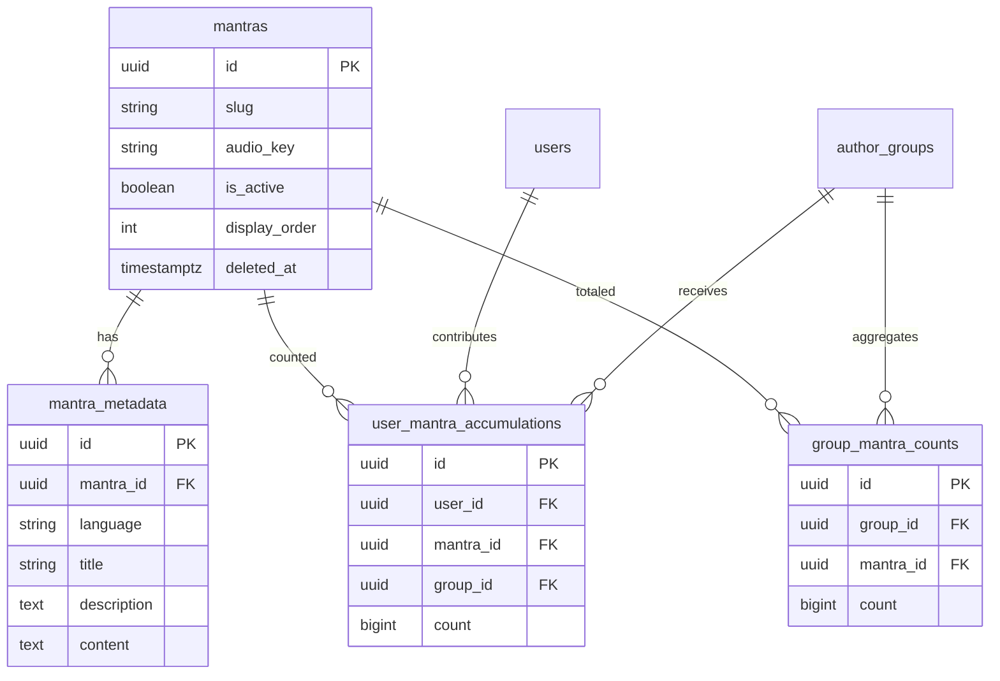

# Mantra Counting — Backend Specification

## 1. Overview

Users accumulate mantra counts while reciting. Each count is tied to a **mantra** and a **user**. Users can **allocate** (divide) their private count across one or more **author groups** they follow. Groups can see **aggregate totals** and **per-member contributions**.

- **One backend:** `WeBuddhist-Backend`
- **One database:** existing PostgreSQL (same as `users`, `author_groups`, `plans`)
- **API root:** `/api/v1`
- **No audit/ledger table** — only current state is stored

### Module layout

```
pecha_api/mantras/
  mantra_models.py
  count_models.py
  mantra_repository.py
  count_repository.py
  mantra_service.py
  count_service.py
  mantra_views.py
  mantra_response_models.py
```

### Router registration

```python
# pecha_api/app.py
api.include_router(public_mantra_router)   # /mantras
api.include_router(cms_mantra_router)      # /cms/mantras
api.include_router(user_mantra_router)     # /users/me/mantra-counts
api.include_router(group_mantra_router)    # /author/groups/{group_id}/mantra-counts
```

---

## 2. Functional requirements

| # | Requirement |
|---|-------------|
| 1 | CMS can create, update, and soft-delete mantras |
| 2 | Mantras have multilingual metadata: title, description, **content** (recitation text) |
| 3 | Public users can list and view active mantras |
| 4 | Authenticated users increment a **private** count per mantra while reciting |
| 5 | Users can allocate part or all of private count to **multiple groups** in one request |
| 6 | User must **follow** each target group to allocate |
| 7 | Users can view private count + per-group allocations |
| 8 | Anyone can view group aggregate totals |
| 9 | Anyone can view **which users contributed how much** to a group per mantra |
| 10 | Client batches increments (not per-tap) |

### Out of scope (v1)

- Allocation history / audit log
- Reclaiming allocated counts from a group
- Separate mantra database
- Per-tap real-time DB writes

---

## 3. Database tables

**4 tables total**

---

### 3.1 `mantras`

Mantra catalog.

| Column | Type | Nullable | Default | Description |
|--------|------|----------|---------|-------------|
| `id` | UUID | NO | `uuid4` | Primary key |
| `slug` | VARCHAR(255) | NO | — | URL-safe unique identifier |
| `audio_key` | VARCHAR(1000) | YES | — | Storage key for audio file |
| `is_active` | BOOLEAN | NO | `true` | Accepts increments when true |
| `display_order` | INTEGER | NO | `0` | UI sort order |
| `created_at` | TIMESTAMPTZ | NO | `now()` | |
| `updated_at` | TIMESTAMPTZ | NO | `now()` | |
| `deleted_at` | TIMESTAMPTZ | YES | — | Soft delete |

**Constraints**
- `slug` unique where `deleted_at IS NULL`

**Indexes**
- `idx_mantras_slug` — unique partial on `slug` where `deleted_at IS NULL`
- `idx_mantras_active` — `(is_active, display_order)` where `deleted_at IS NULL`

---

### 3.2 `mantra_metadata`

Multilingual content per mantra.

| Column | Type | Nullable | Default | Description |
|--------|------|----------|---------|-------------|
| `id` | UUID | NO | `uuid4` | Primary key |
| `mantra_id` | UUID | NO | — | FK → `mantras.id` ON DELETE CASCADE |
| `language` | VARCHAR(10) | NO | — | e.g. `EN`, `BO` |
| `title` | VARCHAR(255) | NO | — | Display name |
| `description` | TEXT | YES | — | Short description |
| `content` | TEXT | NO | — | Mantra recitation text |

**Constraints**
- `UNIQUE (mantra_id, language)`

**Indexes**
- `idx_mantra_metadata_mantra_language` — `(mantra_id, language)`

---

### 3.3 `user_mantra_accumulations`

Private pool and per-user group allocations in one table.

| Column | Type | Nullable | Default | Description |
|--------|------|----------|---------|-------------|
| `id` | UUID | NO | `uuid4` | Primary key |
| `user_id` | UUID | NO | — | FK → `users.id` ON DELETE CASCADE |
| `mantra_id` | UUID | NO | — | FK → `mantras.id` ON DELETE CASCADE |
| `group_id` | UUID | YES | — | FK → `author_groups.id` ON DELETE CASCADE |
| `count` | BIGINT | NO | `0` | CHECK `count >= 0` |
| `created_at` | TIMESTAMPTZ | NO | `now()` | |
| `updated_at` | TIMESTAMPTZ | NO | `now()` | |

**Partial unique constraints**

```sql
UNIQUE (user_id, mantra_id) WHERE group_id IS NULL;
UNIQUE (user_id, mantra_id, group_id) WHERE group_id IS NOT NULL;
```

**Indexes**
- `idx_user_mantra_accum_user` — `(user_id)`
- `idx_user_mantra_accum_user_mantra` — `(user_id, mantra_id)`
- `idx_user_mantra_accum_group_mantra` — `(group_id, mantra_id)` where `group_id IS NOT NULL`

**Row semantics**

| `group_id` | Meaning |
|------------|---------|
| `NULL` | Private unallocated count |
| `uuid` | Count user has allocated to that group |

**Contributor query**

```sql
SELECT uma.user_id, uma.count, u.firstname, u.lastname, u.username, u.avatar_url
FROM user_mantra_accumulations uma
JOIN users u ON u.id = uma.user_id
WHERE uma.group_id = :group_id
  AND uma.mantra_id = :mantra_id
  AND uma.count > 0
ORDER BY uma.count DESC
LIMIT :limit OFFSET :skip;
```

---

### 3.4 `group_mantra_counts`

Denormalized group aggregate totals.

| Column | Type | Nullable | Default | Description |
|--------|------|----------|---------|-------------|
| `id` | UUID | NO | `uuid4` | Primary key |
| `group_id` | UUID | NO | — | FK → `author_groups.id` ON DELETE CASCADE |
| `mantra_id` | UUID | NO | — | FK → `mantras.id` ON DELETE CASCADE |
| `count` | BIGINT | NO | `0` | CHECK `count >= 0` |
| `created_at` | TIMESTAMPTZ | NO | `now()` | |
| `updated_at` | TIMESTAMPTZ | NO | `now()` | |

**Constraints**
- `UNIQUE (group_id, mantra_id)`

**Indexes**
- `idx_group_mantra_counts_group` — `(group_id)`

**Note:** `group_mantra_counts.count` should equal the sum of all `user_mantra_accumulations.count` for the same `group_id` + `mantra_id`.

---

### 3.5 ER diagram



---

### 3.6 Core SQL operations

**Increment** (upsert private row)

```sql
INSERT INTO user_mantra_accumulations (user_id, mantra_id, group_id, count)
VALUES (:user_id, :mantra_id, NULL, :delta)
ON CONFLICT (user_id, mantra_id) WHERE group_id IS NULL
DO UPDATE SET
    count = user_mantra_accumulations.count + EXCLUDED.count,
    updated_at = NOW()
RETURNING count;
```

**Allocate** (single transaction)

```sql
BEGIN;

-- 1. Lock private row
SELECT count FROM user_mantra_accumulations
WHERE user_id = :user_id AND mantra_id = :mantra_id AND group_id IS NULL
FOR UPDATE;

-- 2. Validate sum(amounts) <= private.count

-- 3. Decrease private count
UPDATE user_mantra_accumulations
SET count = count - :total_amount, updated_at = NOW()
WHERE user_id = :user_id AND mantra_id = :mantra_id AND group_id IS NULL;

-- 4. Per group: upsert user allocation row
INSERT INTO user_mantra_accumulations (user_id, mantra_id, group_id, count)
VALUES (:user_id, :mantra_id, :group_id, :amount)
ON CONFLICT (user_id, mantra_id, group_id) WHERE group_id IS NOT NULL
DO UPDATE SET
    count = user_mantra_accumulations.count + EXCLUDED.count,
    updated_at = NOW();

-- 5. Per group: upsert group aggregate
INSERT INTO group_mantra_counts (group_id, mantra_id, count)
VALUES (:group_id, :mantra_id, :amount)
ON CONFLICT (group_id, mantra_id)
DO UPDATE SET
    count = group_mantra_counts.count + EXCLUDED.count,
    updated_at = NOW();

COMMIT;
```

---

## 4. Authentication

| Endpoint group | Auth |
|----------------|------|
| Public catalog, group totals, contributors | None |
| User accumulation | `Authorization: Bearer <token>` |
| CMS mantra management | Bearer + CMS permission |

---

## 5. API reference

Base URL: `/api/v1`

---

### 5.1 Public — Mantra catalog

**Router prefix:** `/mantras`

#### `GET /mantras`

List active mantras.

**Query parameters**

| Name | Type | Required | Default | Description |
|------|------|----------|---------|-------------|
| `language` | string | No | `EN` | Metadata language |
| `skip` | integer | No | `0` | Pagination offset |
| `limit` | integer | No | `20` | Page size (max 100) |

**Response `200 OK`**

```json
{
  "mantras": [
    {
      "id": "3fa85f64-5717-4562-b3fc-2c963f66afa6",
      "slug": "medicine-buddha",
      "title": "Medicine Buddha Mantra",
      "description": "Medicine Buddha practice mantra.",
      "content": "Tayatha om bekandze bekandze maha bekandze radza samudgate soha",
      "audio_url": "https://cdn.example.com/mantras/medicine-buddha.mp3",
      "display_order": 1
    }
  ],
  "total": 12,
  "skip": 0,
  "limit": 20
}
```

---

#### `GET /mantras/{mantra_id}`

Get one active mantra.

**Path parameters**

| Name | Type | Description |
|------|------|-------------|
| `mantra_id` | UUID | Mantra ID |

**Query parameters**

| Name | Type | Required | Default |
|------|------|----------|---------|
| `language` | string | No | `EN` |

**Response `200 OK`**

```json
{
  "id": "3fa85f64-5717-4562-b3fc-2c963f66afa6",
  "slug": "medicine-buddha",
  "title": "Medicine Buddha Mantra",
  "description": "Medicine Buddha practice mantra.",
  "content": "Tayatha om bekandze bekandze maha bekandze radza samudgate soha",
  "audio_url": "https://cdn.example.com/mantras/medicine-buddha.mp3",
  "display_order": 1
}
```

**Errors**

| Status | Condition |
|--------|-----------|
| `404` | Mantra not found, inactive, or deleted |

---

### 5.2 User — Accumulation

**Router prefix:** `/users/me/mantra-counts`  
**Auth:** Bearer token required

#### `GET /users/me/mantra-counts`

List all mantra counts for the authenticated user.

**Query parameters**

| Name | Type | Required | Default |
|------|------|----------|---------|
| `language` | string | No | `EN` |
| `skip` | integer | No | `0` |
| `limit` | integer | No | `20` |

**Response `200 OK`**

```json
{
  "counts": [
    {
      "mantra_id": "3fa85f64-5717-4562-b3fc-2c963f66afa6",
      "mantra_slug": "medicine-buddha",
      "mantra_title": "Medicine Buddha Mantra",
      "private_count": 200,
      "allocated_count": 300,
      "total_count": 500,
      "updated_at": "2026-06-05T10:30:00Z"
    }
  ],
  "total": 3,
  "skip": 0,
  "limit": 20
}
```

**Field definitions**

| Field | Description |
|-------|-------------|
| `private_count` | Unallocated count (`group_id IS NULL`) |
| `allocated_count` | Sum of all group allocation rows |
| `total_count` | `private_count + allocated_count` |

---

#### `GET /users/me/mantra-counts/{mantra_id}`

Get count breakdown for one mantra.

**Path parameters**

| Name | Type | Description |
|------|------|-------------|
| `mantra_id` | UUID | Mantra ID |

**Query parameters**

| Name | Type | Required | Default |
|------|------|----------|---------|
| `language` | string | No | `EN` |

**Response `200 OK`**

```json
{
  "mantra_id": "3fa85f64-5717-4562-b3fc-2c963f66afa6",
  "mantra_slug": "medicine-buddha",
  "mantra_title": "Medicine Buddha Mantra",
  "private_count": 200,
  "allocated_count": 300,
  "total_count": 500,
  "allocations": [
    {
      "group_id": "7c9e6679-7425-40de-944b-e07fc1f90ae7",
      "group_slug": "kagyu-group",
      "group_title": "Kagyu Group",
      "count": 200
    },
    {
      "group_id": "8d0e7780-8536-51ef-a55c-f18gd2g01bf8",
      "group_slug": "nyingma-group",
      "group_title": "Nyingma Group",
      "count": 100
    }
  ],
  "updated_at": "2026-06-05T10:30:00Z"
}
```

**Notes**
- If no rows exist, return all counts as `0` and `allocations: []`

---

#### `POST /users/me/mantra-counts/{mantra_id}/increment`

Add to the user's **private** count.

**Path parameters**

| Name | Type | Description |
|------|------|-------------|
| `mantra_id` | UUID | Mantra ID |

**Request body**

```json
{
  "delta": 108
}
```

| Field | Type | Required | Validation |
|-------|------|----------|------------|
| `delta` | integer | Yes | `1 <= delta <= 10000` |

**Response `200 OK`**

```json
{
  "mantra_id": "3fa85f64-5717-4562-b3fc-2c963f66afa6",
  "private_count": 308,
  "updated_at": "2026-06-05T10:35:00Z"
}
```

**Errors**

| Status | Condition |
|--------|-----------|
| `400` | Invalid `delta` |
| `404` | Mantra not found or inactive |

**Service logic**
1. Resolve `user_id` from token
2. Verify mantra exists, `is_active = true`, `deleted_at IS NULL`
3. Upsert private row (`group_id IS NULL`)
4. Return updated private count

---

#### `POST /users/me/mantra-counts/{mantra_id}/allocate`

Divide private count across one or more groups.

**Path parameters**

| Name | Type | Description |
|------|------|-------------|
| `mantra_id` | UUID | Mantra ID |

**Request body**

```json
{
  "allocations": [
    { "group_id": "7c9e6679-7425-40de-944b-e07fc1f90ae7", "amount": 150 },
    { "group_id": "8d0e7780-8536-51ef-a55c-f18gd2g01bf8", "amount": 50 }
  ]
}
```

| Field | Type | Required | Validation |
|-------|------|----------|------------|
| `allocations` | array | Yes | Min 1 item |
| `allocations[].group_id` | UUID | Yes | User must follow group |
| `allocations[].amount` | integer | Yes | `> 0` |

**Validation rules**
- No duplicate `group_id` in the same request
- `sum(amounts) <= private_count`
- Each group exists and `deleted_at IS NULL`
- User follows each group (`author_group_followers`)
- Mantra is active

**Response `200 OK`**

```json
{
  "mantra_id": "3fa85f64-5717-4562-b3fc-2c963f66afa6",
  "private_count_before": 200,
  "private_count_after": 0,
  "total_allocated": 200,
  "allocations_applied": [
    {
      "group_id": "7c9e6679-7425-40de-944b-e07fc1f90ae7",
      "amount": 150,
      "user_group_count_after": 350,
      "group_total_after": 1200
    },
    {
      "group_id": "8d0e7780-8536-51ef-a55c-f18gd2g01bf8",
      "amount": 50,
      "user_group_count_after": 150,
      "group_total_after": 450
    }
  ],
  "allocated_at": "2026-06-05T11:00:00Z"
}
```

**Errors**

| Status | Condition |
|--------|-----------|
| `400` | Insufficient private count, invalid amounts, duplicate groups in request |
| `403` | User does not follow one or more groups |
| `404` | Mantra or group not found |

---

### 5.3 Public — Group totals & contributors

**Router prefix:** `/author/groups/{group_id}/mantra-counts`

#### `GET /author/groups/{group_id}/mantra-counts`

List aggregate mantra totals for a group.

**Path parameters**

| Name | Type | Description |
|------|------|-------------|
| `group_id` | UUID | Author group ID |

**Query parameters**

| Name | Type | Required | Default |
|------|------|----------|---------|
| `language` | string | No | `EN` |
| `skip` | integer | No | `0` |
| `limit` | integer | No | `20` |

**Response `200 OK`**

```json
{
  "group_id": "7c9e6679-7425-40de-944b-e07fc1f90ae7",
  "counts": [
    {
      "mantra_id": "3fa85f64-5717-4562-b3fc-2c963f66afa6",
      "mantra_slug": "medicine-buddha",
      "mantra_title": "Medicine Buddha Mantra",
      "count": 1200,
      "contributor_count": 8,
      "updated_at": "2026-06-05T11:00:00Z"
    }
  ],
  "total": 2,
  "skip": 0,
  "limit": 20
}
```

| Field | Description |
|-------|-------------|
| `count` | Group aggregate total |
| `contributor_count` | Number of users with `count > 0` for this group+mantra |

**Errors**

| Status | Condition |
|--------|-----------|
| `404` | Group not found or deleted |

---

#### `GET /author/groups/{group_id}/mantra-counts/{mantra_id}`

Get group total for one mantra, with optional contributor summary.

**Query parameters**

| Name | Type | Required | Default | Description |
|------|------|----------|---------|-------------|
| `language` | string | No | `EN` | Mantra title language |
| `include_contributors` | boolean | No | `false` | Include top contributors inline |

**Response `200 OK`**

```json
{
  "group_id": "7c9e6679-7425-40de-944b-e07fc1f90ae7",
  "mantra_id": "3fa85f64-5717-4562-b3fc-2c963f66afa6",
  "mantra_slug": "medicine-buddha",
  "mantra_title": "Medicine Buddha Mantra",
  "count": 1200,
  "contributor_count": 8,
  "updated_at": "2026-06-05T11:00:00Z",
  "top_contributors": [
    {
      "user_id": "uuid",
      "firstname": "Tenzin",
      "lastname": "Kunsang",
      "username": "tenzin",
      "avatar_url": "https://cdn.example.com/avatars/tenzin.jpg",
      "count": 350,
      "updated_at": "2026-06-05T11:00:00Z"
    }
  ]
}
```

**Notes**
- `top_contributors` only returned when `include_contributors=true`
- Returns top 5 contributors by `count DESC`
- If no rows exist, return `count: 0`, `contributor_count: 0`, `top_contributors: []`

---

#### `GET /author/groups/{group_id}/mantra-counts/{mantra_id}/contributors`

List all users who contributed to a group for a specific mantra.

**Query parameters**

| Name | Type | Required | Default | Description |
|------|------|----------|---------|-------------|
| `skip` | integer | No | `0` | Pagination offset |
| `limit` | integer | No | `20` | Page size (max 100) |
| `sort_by` | string | No | `count` | `count` or `updated_at` |
| `sort_order` | string | No | `desc` | `asc` or `desc` |

**Response `200 OK`**

```json
{
  "group_id": "7c9e6679-7425-40de-944b-e07fc1f90ae7",
  "mantra_id": "3fa85f64-5717-4562-b3fc-2c963f66afa6",
  "mantra_slug": "medicine-buddha",
  "mantra_title": "Medicine Buddha Mantra",
  "group_total": 1200,
  "contributors": [
    {
      "user_id": "uuid",
      "firstname": "Tenzin",
      "lastname": "Kunsang",
      "username": "tenzin",
      "avatar_url": "https://cdn.example.com/avatars/tenzin.jpg",
      "count": 350,
      "updated_at": "2026-06-05T11:00:00Z"
    },
    {
      "user_id": "uuid",
      "firstname": "Jane",
      "lastname": "Doe",
      "username": "jane",
      "avatar_url": null,
      "count": 200,
      "updated_at": "2026-06-04T09:15:00Z"
    }
  ],
  "total": 8,
  "skip": 0,
  "limit": 20
}
```

| Field | Description |
|-------|-------------|
| `count` | This user's total contribution to this group for this mantra |
| `group_total` | Sum from `group_mantra_counts` |
| `contributors` | Users with `user_mantra_accumulations.count > 0` for this group+mantra |

**Errors**

| Status | Condition |
|--------|-----------|
| `404` | Group or mantra not found |

---

### 5.4 CMS — Mantra management

**Router prefix:** `/cms/mantras`  
**Auth:** CMS Bearer token required

#### `POST /cms/mantras`

Create a mantra.

**Request body**

```json
{
  "slug": "medicine-buddha",
  "audio_key": "mantras/medicine-buddha.mp3",
  "display_order": 1,
  "is_active": true,
  "metadata": [
    {
      "language": "EN",
      "title": "Medicine Buddha Mantra",
      "description": "Medicine Buddha practice mantra.",
      "content": "Tayatha om bekandze bekandze maha bekandze radza samudgate soha"
    },
    {
      "language": "BO",
      "title": "སྨན་བླའི་སྔགས།",
      "description": null,
      "content": "ཨོཾ་བེ་ཀཱནྜེ་བེ་ཀཱནྜེ་མ་ཧཱ་བེ་ཀཱནྜེ་རཱ་ཛ་ས་མུདྒ་ཏེ་སྭཱ་ཧཱ།"
    }
  ]
}
```

| Field | Type | Required | Validation |
|-------|------|----------|------------|
| `slug` | string | Yes | Unique, not empty |
| `audio_key` | string | No | |
| `display_order` | integer | No | Default `0` |
| `is_active` | boolean | No | Default `true` |
| `metadata` | array | Yes | Min 1 item |
| `metadata[].language` | string | Yes | |
| `metadata[].title` | string | Yes | |
| `metadata[].description` | string | No | |
| `metadata[].content` | string | Yes | Non-empty recitation text |

**Response `201 Created`**

```json
{
  "id": "3fa85f64-5717-4562-b3fc-2c963f66afa6",
  "slug": "medicine-buddha",
  "audio_key": "mantras/medicine-buddha.mp3",
  "audio_url": "https://cdn.example.com/mantras/medicine-buddha.mp3",
  "is_active": true,
  "display_order": 1,
  "metadata": [
    {
      "language": "EN",
      "title": "Medicine Buddha Mantra",
      "description": "Medicine Buddha practice mantra.",
      "content": "Tayatha om bekandze bekandze maha bekandze radza samudgate soha"
    }
  ],
  "created_at": "2026-06-05T09:00:00Z",
  "updated_at": "2026-06-05T09:00:00Z"
}
```

---

#### `PUT /cms/mantras/{mantra_id}`

Update mantra and/or metadata. All fields optional.

**Response `200 OK`** — full CMS mantra DTO.

---

#### `DELETE /cms/mantras/{mantra_id}`

Soft-delete mantra (`deleted_at` set, `is_active = false`).

**Response `204 No Content`**

---

#### `GET /cms/mantras`

List all mantras including inactive.

**Query parameters**

| Name | Type | Required | Default |
|------|------|----------|---------|
| `language` | string | No | `EN` |
| `is_active` | boolean | No | — |
| `skip` | integer | No | `0` |
| `limit` | integer | No | `20` |

**Response `200 OK`** — paginated CMS mantra list with `is_active`, `created_at`, full metadata including `content`.

---

## 6. Endpoint summary

| # | Method | Path | Auth | Description |
|---|--------|------|------|-------------|
| 1 | `GET` | `/mantras` | — | List active mantras |
| 2 | `GET` | `/mantras/{mantra_id}` | — | Get one mantra |
| 3 | `GET` | `/users/me/mantra-counts` | User | List user's counts |
| 4 | `GET` | `/users/me/mantra-counts/{mantra_id}` | User | Count breakdown with allocations |
| 5 | `POST` | `/users/me/mantra-counts/{mantra_id}/increment` | User | Add to private pool |
| 6 | `POST` | `/users/me/mantra-counts/{mantra_id}/allocate` | User | Divide private count to groups |
| 7 | `GET` | `/author/groups/{group_id}/mantra-counts` | — | Group totals per mantra |
| 8 | `GET` | `/author/groups/{group_id}/mantra-counts/{mantra_id}` | — | One mantra total (+ optional top contributors) |
| 9 | `GET` | `/author/groups/{group_id}/mantra-counts/{mantra_id}/contributors` | — | Full contributor list |
| 10 | `POST` | `/cms/mantras` | CMS | Create mantra |
| 11 | `PUT` | `/cms/mantras/{mantra_id}` | CMS | Update mantra |
| 12 | `DELETE` | `/cms/mantras/{mantra_id}` | CMS | Soft-delete mantra |
| 13 | `GET` | `/cms/mantras` | CMS | List all mantras |

---

## 7. Pydantic models

### Request models

```python
class MantraMetadataInput(BaseModel):
    language: str
    title: str
    description: str | None = None
    content: str = Field(..., min_length=1)

class CreateMantraRequest(BaseModel):
    slug: str
    audio_key: str | None = None
    display_order: int = 0
    is_active: bool = True
    metadata: list[MantraMetadataInput] = Field(..., min_length=1)

class UpdateMantraRequest(BaseModel):
    slug: str | None = None
    audio_key: str | None = None
    display_order: int | None = None
    is_active: bool | None = None
    metadata: list[MantraMetadataInput] | None = None

class IncrementMantraCountRequest(BaseModel):
    delta: int = Field(..., gt=0, le=10000)

class GroupAllocationItem(BaseModel):
    group_id: UUID
    amount: int = Field(..., gt=0)

class AllocateMantraCountRequest(BaseModel):
    allocations: list[GroupAllocationItem] = Field(..., min_length=1)
```

### Response models

```python
class MantraDTO(BaseModel):
    id: UUID
    slug: str
    title: str
    description: str | None
    content: str
    audio_url: str | None
    display_order: int

class CmsMantraDTO(MantraDTO):
    audio_key: str | None
    is_active: bool
    metadata: list[MantraMetadataInput]
    created_at: datetime
    updated_at: datetime

class UserGroupAllocationDTO(BaseModel):
    group_id: UUID
    group_slug: str
    group_title: str
    count: int

class UserMantraCountSummaryDTO(BaseModel):
    mantra_id: UUID
    mantra_slug: str
    mantra_title: str
    private_count: int
    allocated_count: int
    total_count: int
    updated_at: datetime

class UserMantraCountDetailDTO(UserMantraCountSummaryDTO):
    allocations: list[UserGroupAllocationDTO]

class IncrementMantraCountResponse(BaseModel):
    mantra_id: UUID
    private_count: int
    updated_at: datetime

class AllocationAppliedDTO(BaseModel):
    group_id: UUID
    amount: int
    user_group_count_after: int
    group_total_after: int

class AllocateMantraCountResponse(BaseModel):
    mantra_id: UUID
    private_count_before: int
    private_count_after: int
    total_allocated: int
    allocations_applied: list[AllocationAppliedDTO]
    allocated_at: datetime

class MantraContributorDTO(BaseModel):
    user_id: UUID
    firstname: str
    lastname: str | None
    username: str | None
    avatar_url: str | None
    count: int
    updated_at: datetime

class GroupMantraCountDTO(BaseModel):
    mantra_id: UUID
    mantra_slug: str
    mantra_title: str
    count: int
    contributor_count: int
    updated_at: datetime

class GroupMantraCountDetailDTO(BaseModel):
    group_id: UUID
    mantra_id: UUID
    mantra_slug: str
    mantra_title: str
    count: int
    contributor_count: int
    updated_at: datetime
    top_contributors: list[MantraContributorDTO] | None = None

class GroupMantraContributorsResponse(BaseModel):
    group_id: UUID
    mantra_id: UUID
    mantra_slug: str
    mantra_title: str
    group_total: int
    contributors: list[MantraContributorDTO]
    total: int
    skip: int
    limit: int
```

---

## 8. Business rules

| # | Rule |
|---|------|
| 1 | Increments only affect the private row (`group_id IS NULL`) |
| 2 | Allocation moves count from private → user group rows + group aggregate |
| 3 | Partial allocation allowed — user keeps remaining private count |
| 4 | Multiple groups allowed in one allocate request |
| 5 | `sum(allocation amounts) <= private_count` at time of request |
| 6 | User must follow every target group |
| 7 | No duplicate `group_id` in a single allocate request |
| 8 | Inactive or soft-deleted mantras reject increment and allocate |
| 9 | `count` is always `BIGINT >= 0` |
| 10 | Client batches increments; max `10000` per request |
| 11 | `content` is required per metadata entry on create |
| 12 | No audit table — only current state stored |
| 13 | `group_mantra_counts.count` = sum of all user contributions for that group+mantra |
| 14 | Contributor `count` = user's row in `user_mantra_accumulations` for group+mantra |
| 15 | Only users with `count > 0` appear in contributor lists |
| 16 | Contributor lists sorted by `count DESC` by default |
| 17 | Group contributor endpoints are public (same as group totals) |

---

## 9. Data flow example

```
User A recites → private_count = 500
User A allocates 200 to Group X, 100 to Group Y
  → private_count = 200
  → user_mantra_accumulations (A, mantra, Group X) = 200
  → user_mantra_accumulations (A, mantra, Group Y) = 100
  → group_mantra_counts (Group X, mantra) += 200
  → group_mantra_counts (Group Y, mantra) += 100

GET /author/groups/Group X/mantra-counts/{mantra_id}/contributors
  → [{ user: A, count: 200 }, ...]
```

---

## 10. Error responses

```json
{
  "detail": "Insufficient private count. Available: 200, requested: 300."
}
```

| HTTP | Use case |
|------|----------|
| `400` | Validation failure, insufficient private count, duplicate groups |
| `401` | Missing or invalid token |
| `403` | Not following group / no CMS access |
| `404` | Mantra or group not found |
| `422` | Pydantic schema validation |
| `500` | Unexpected server error |

---

## 11. Migration

Single Alembic migration on existing PostgreSQL:

| Table | Action |
|-------|--------|
| `mantras` | CREATE |
| `mantra_metadata` | CREATE (includes `content TEXT NOT NULL`) |
| `user_mantra_accumulations` | CREATE |
| `group_mantra_counts` | CREATE |

Uses existing `get_db()` session — no second database connection.

---

## 12. Test plan

### Database
- [ ] Private row created on first increment
- [ ] Increment is additive and never goes negative
- [ ] Partial allocate leaves remaining private count
- [ ] Multi-group allocate in one request works
- [ ] Allocate rejected when sum > private count
- [ ] Allocate rejected when user does not follow group
- [ ] Group aggregate updated correctly
- [ ] Concurrent increment + allocate safe under row lock
- [ ] Inactive/deleted mantra rejects increment and allocate
- [ ] `content` stored and returned per language

### API
- [ ] Public mantra list returns only active mantras with `content`
- [ ] CMS create/update/delete mantra
- [ ] User count breakdown shows private + per-group allocations
- [ ] Group totals visible without auth
- [ ] Contributor list returns correct users and counts
- [ ] Only users with `count > 0` included in contributors
- [ ] `contributor_count` matches actual contributor rows
- [ ] `group_total` equals sum of contributor counts
- [ ] `include_contributors=true` returns top 5 on detail endpoint
- [ ] Pagination works on contributors endpoint
- [ ] All endpoints return correct status codes

---

## 13. Future enhancements

- Reclaim / reverse allocation
- `mantra_count_sessions` for offline/long recitation
- Link `mantras.text_id` to Mongo recitation texts
- `lifetime_count` separate from transferable private pool
- Redis hot counter with async Postgres flush for high write volume
